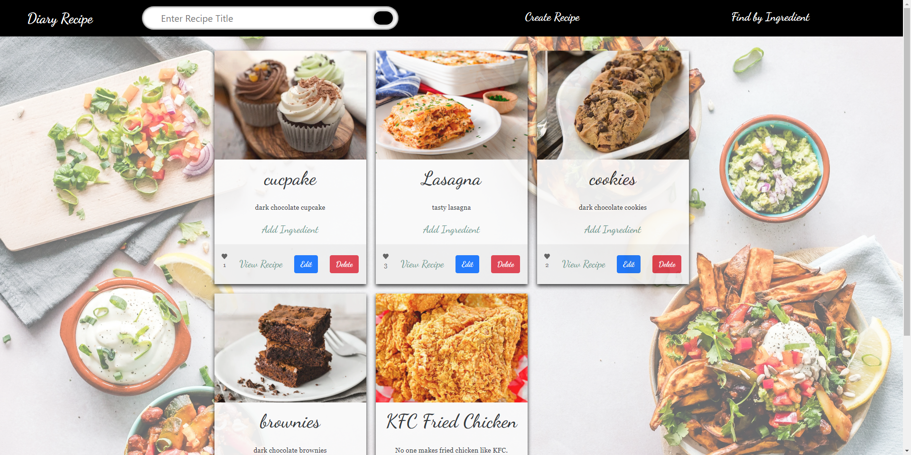

# FWE - Recipe Website

Dwiresti Puspita Rahmi (768553)

## Frontend

### Website Preview
- Recipe Homepage

- Create Recipe

- Search Recipe

- Recipe Detail

- Edit Recipe

- Find by Ingredient

- Add Ingredient

- Ingredient Details

### The Functionality of The Recipe Website

1. Get all recipes at the homepage of the website

   - To visit the homepage, enter this url: http://localhost:3000/api/recipe. It is also possible to just click on the logo of the website "Diary Recipe"
   - on this homepage you will see all the recipes available. On each recipes, the picture, description, and number of likes for the recipe will be shown.
   - Functionality on this page are as follows:
     1. Edit Recipe
        - you can edit the available ingredient by clicking the button "edit", and there will be a popup to on the screen to edit the existing recipe.
        - to save the things that you have edited, simply click the button "edit".
        - to cancel the edit, you can click the field outside to popup window, or you can also click "close".
     2. Delete Recipe
        - to delete a specific recipe, click the button "delete" on the recipe that you wanted to delete.
     3. View Recipe
        - to view the details on the recipe (all required ingredient, etc.) you can click the word "View Recipe" on the bottom of each recipe.
     4. Give like
        - to represent the rating of each recipe, a number of likes will be implemented.
        - to give like: click the heart button on the bottom of each recipe.
     5. Add ingredient to the specific recipe
        - above the edit and delete button is a clickable link to add ingredient to the recipe. you will be directeed to a page to add more ingredients.
2. Create a new Recipe

   - On the website you will see a navigation bar at the top of the website. There you can find the option to create a new recipe, which is represented by the option "Create Recipe"
   - left click on the option and this will take you to the create new recipe page.
   - In the create recipe page you will have to fill a few input fields:
     1. Recipe Title (mandatory, because it is a primary key)
     2. Recipe Description
     3. Picture Link (here you will have to give a link to a specific image)
     4. Steps or instruction to cook the recipe
     5. The next field will be the ingredient which will be used for this recipe. In this Ingredient field you have to input the following fields:
        1. Ingredient Name
        2. Amount of the ingredient needed
        3. unit of the amount (ml, piece, gr, cup, tsp, tbs, etc.)
        4. You will have the option to remove the current ingredient, or add another field to add more ingredient to the recipe
        5. After all the required fields are filled, you can then submit the recipe by left-clicking the button "Create Recipe". Then the page will be redirected to the homepage of all the recipes
3. Search Recipe by Recipe Title

   - on the navbar of the website you can search recipes by typing the recipe title and click the black button on the search field.
   - you will be directed to the recipe result page.
   - the details to the recipe can be obtained by clicking on the word "View Recipe"
   - after clicking "View Recipe", you will be directed to the Recipe details
4. Find recipe by ingredient name

   - on the corner right of the navbar is the functionality to find recipe by giving an ingredient name.
5. View Recipe with all its details (also di ingredients required in a recipe)

   - every clickable "View Recipe" directs to a detailed page of the recipe

---

## Instruction

### Setup Backend and Frontend

**Steps to run backend project:**

1. Run cd `\packages\backend` command
2. Run `npm i` command
3. Run `npm run dev` command

**Steps to run frontend project:**

1. Run cd `\packages\frontend` command
2. Run `npm i` command
3. Run `npm start`

Run the Backend first and then run the frontend afterwards

---

### Technical Project Description

- React.js
  Framework to create a Website
- Typescript
  Programming Language to implement the frontend

## Backend

### Technical Project Description

- Express
  Express will be used to implement the Webserver for the Backend
- POSTGRESQL
  To implement the database side for the server to persist the data which will be used to develop this project
- node.js
  package manager to put modules in place, so that node can find them and manages the dependency conflicts. This will be used to install node programs.
- Typescript
  The Programming Language which is used to develop the backend

### Features and API Reference

1. Recipe Controller : Implements the HTTP Request for Recipe

   1. Returns all recipe

      - Method in RecipeController.ts
        allRecipe()
      - HTTP Request
        GET /api/recipe
   2. Returns a recipe with a given recipe title as parameter

      - Method in RecipeController.ts
        getOneRecipe()
      - HTTP Request
        GET /api/recipe/:title
   3. Returns a recipe with all the ingredients in it

      - Method in RecipeController.ts
        getRecipeDetails()
      - HTTP Request
        GET api/recipe/detail/:title
   4. Creates a new Recipe

      - Method in RecipeController.ts
        saveRecipe()
      - HTTP Request
        POST /api/recipe/create
      - Required:
        1. title (recipe Title)
        2. description
        3. pictureLink
        4. steps
   5. Deletes an existing Recipe

      - Method in RecipeController.ts
        removeRecipe()
      - HTTP Request
        DELETE /api/recipe/:title
      - Required:
        1. title as parameter
   6. Edits an existing Recipe

      - Method in RecipeController.ts
        updateRecipe()
      - HTTP Request
        PUT /api/recipe/:title
      - Required:
        1. title as parameter
2. Ingredient Controller : Implements the HTTP Request for Ingredient

   1. Returns all created ingredient
      - Method in IngredientController.ts
        getAllIngredient()
      - HTTP Request
        GET /api/ingredient
   2. Returns a spesific ingredient by giving an ingredientName in the parameter
      - Method in IngredientController.ts
        getOneIngredient()
      - HTTP Request
        GET /api/ingredient/:name
   3. Creates a new ingredient
      - Method in IngredientController.ts
        saveIngredient()
      - HTTP Request
        POST /api/ingredient
      - Required:
        1. ingredientName
        2. description
        3. pictureLink
   4. Delete an existing ingredient
      - Method in IngredientController.ts
        removeIngreduent()
      - HTTP Request
        DELETE /api/ingredient/:name
      - Required:
        1. name (ingredient Name) as parameter
   5. Edit an existing ingredient
      - Method in IngredientController.ts
        updateIngredient()
      - HTTP Request
        PUT /api/ingredient/:name
      - Required:
        1. name (ingredient name)
3. IngredientsInRecipe Controller

   1. Returns all ingredients that is used in a recipe

      - Method in IngredientsInRecipe.ts
        getAllIngredientsInRecipe()
      - HTTP Request
        GET /api/ingredientsInRecipe
   2. Returns recipe that used a specific ingredient

      - Method in IngredientsInRecipe.ts
        getRecipeByIngredientName()
      - HTTP Request
        GET /api/ingredientsInRecipe/:ingredientName
      - Required:
        ingredientName
   3. Adds a new ingredient in an existing recipe

      - Method in IngredientsInRecipe.ts
        saveIngredientInRecipe()
      - HTTP Request
        POST /api/ingredientsInRecipe
      - Required:
        1. ingredientName
        2. recipeTitle
        3. amount
        4. unit
   4. Delete an ingredient that is used in a specific recipe

      - Method in IngredientsInRecipe.ts
        removeIngredientFromRecipe()
      - HTTP Request
        DELETE /api/ingredientsinrecipe/:title/
      - Required:
        1. title
        2. ingredientName
   5. Edits a specific ingredient in a specific recipe

      - Method in IngredientsInRecipe.ts
        updateIngredientInRecipe()
      - HTTP Request
        PUT /api/ingredientsInRecipe/:title/:ingredientName
      - Required:
        1. title (recipe title)
        2. ingredientName (ingredient Name)

### TESTING

The testing for the backend can be found in directory test. For this test, a few testdata will be needed.

- testdata:

  1. recipe.json : to check route to create a recipe
  2. updatedRecipe.json : to check route to update a recipe
  3. failRecipe.json : to check when the title is not provided
  4. ingredient.json : to check to create an ingredient
  5. updatedIngredient.json : to check route to update an ingredient
  6. failIngredient.json : to check when the ingredient name is not given
- To be tested:

  1. RecipeController.test.ts

     - Create Recipe
       the recipe.json will be sent to create a recipe. expected is that the contain of the response the same as the one from the recipe.json file and that it gives 200 as a status code
     - Return Recipe with the given recipe title
       the recipe.json will be compared with the response from the get route.
     - Update Recipe with the given recipe title
       recipeUpdated.json will be compared with the response from the put route
     - Delete Recipe
       to be expected is a status code 200
     - Fail Delete
       to be expected is a status code 400 when the deleted recipe wanted to be deleted again
     - Fail Create Recipe
       to be expected is a status code 400 when the recipe title is not given
  2. IngredientController.test.ts

     - Create Ingredient
       the ingredient.json will be sent to create a ingredient. expected is that the contain of the response the same as the one from the ingredient.json file and that it gives 200 as a status code
     - Return Ingredient with the given ingredient name
       the ingredient.json will be compared with the response from the get route.
     - Update ingredient with the given ingredient name
       ingredientUpdated.json will be compared with the response from the put route
     - Delete Ingredient
       to be expected is a status code 200
     - Fail Delete
       to be expected is a status code 400 when the deleted ingredient wanted to be deleted again
     - Fail Create Ingredient
       to be expected is a status code 400 when the ingredient name is not given
  3. IngredientsInRecipeController.test.ts

    - Create Ingredient in recipe
        first ingredient and recipe should be created, then add ingredient in recipe using test data ingredientInRecipe.json
    - Get recipe by ingredient
        expected is status code 200
    - Put Ingredient
        expected is status code 200
    - Delete ingredient
        expected is status code 200
    - Fail delete
        expected is status 400 when deleted ingredient in recipe tried to be deleted again
    - Fail Create
        expected is a status code 400 when recipe title is not available using 
        failIngredientInRecipe.json

     -------------------------------------

